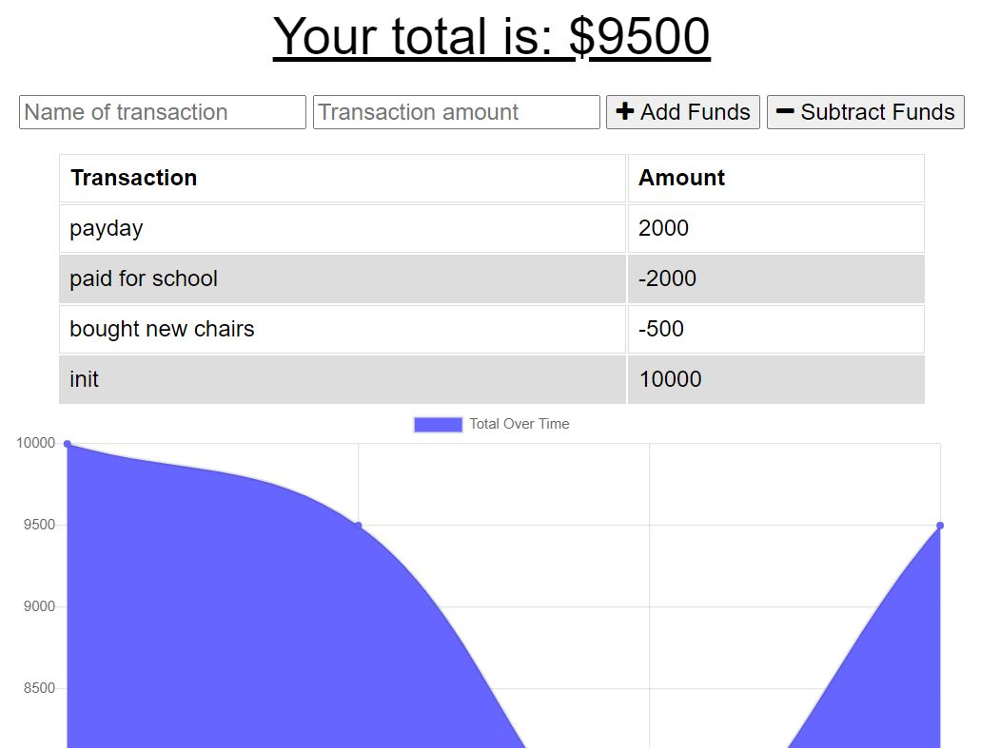

# Budgeter
  
  ## Description 
      This app allows a user to keep track of spending, both online and offline.
## Table of Contents
1.[Usage](#Usage)
2.[Contribution](#Contribution)
3.[Questions](#Questions)

## Usage
    This project was designed to allow a user to utilize a budget database, whether the local machine is online or offline. By utilizing cache files, items can be entered into the database, and then the files will be sent to the Db in the event of no internet connection 
## Installation Requirements
    Run 'npm install' to  install needed node modules.            
## Contribution 
    Please contact Ben de Garcia to work on future iterations.
## Questions
  
If you have questions, contact me at [GitHub](https://github.com/bdegarcia).